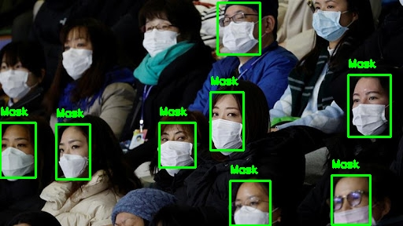

# Face Mask Detection

Detecting face mask with OpenCV and TensorFlow. Using simple CNN or model provided by TensorFlow as MobileNetV2, VGG16, Xception.


## Data

Raw data collected from kaggle and script crawl_image.py, split to 'Mask' and 'Non Mask' class.

Using build_data.py to extract faces from raw dataset and resize to 64x64.

## Installation

Clone the repo

```
git clone git@github.com:ksvbka/face-mask-detector.git
```
cd to project folder and create virtual env

```
virtualenv .env
source .env/bin/activate
pip install -r requirements.txt
```

Download raw dataset and execute script build_dataset.py to preprare dataset for training
```
cd data
bash download_data.sh
cd -
python3 build_dataset.py --data-dir data/64x64_dataset --output-dir data/dataset_raw/
```
## Training

Change model by comment or uncommend from train.py source code.

```
# Build model
model = CNN_model()
# model = MobileNetV2_model()
# model = VGG16_model()
# model = Xception_model()
model.summary()
```

Execute train.py script and pass dataset dir and epochs to it.
```
python3 train.py --data-dir data/64x64_dataset --epochs 20
```

## Testing

```
python3 mask_detect_image.py -i demo_image/2.jpg
```
## Demo




